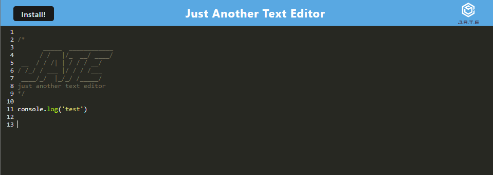

 # Pwa-jate
  
## Description
    This is a text editor that utilises stored data with multiple methods of persistence and can be installed to run offline
## Table of Contents
[Installation](#installation)

[Usage](#usage)

[Questions](#questions)
### Installation
     open the app in your webbrowser, click the install button and click yes on the prompt.
### Usage
     type directly into the text editor, or clock the install key to download an offline version.
 
     
### Questions
for additional questions, please reach out to me on github
[SeanDRowan](https://github.com/SeanDRowan)
    or by email at
<sdrowan93@gmail.com>
     
